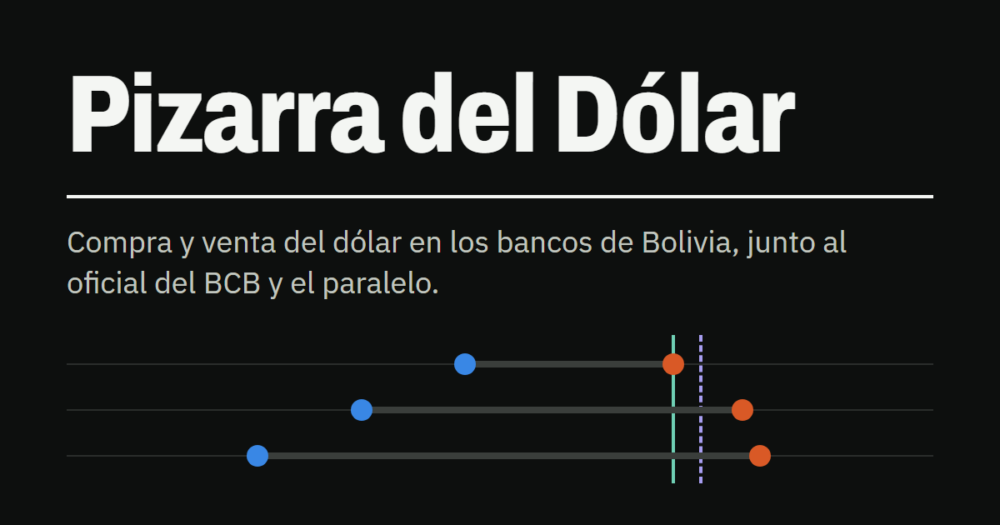
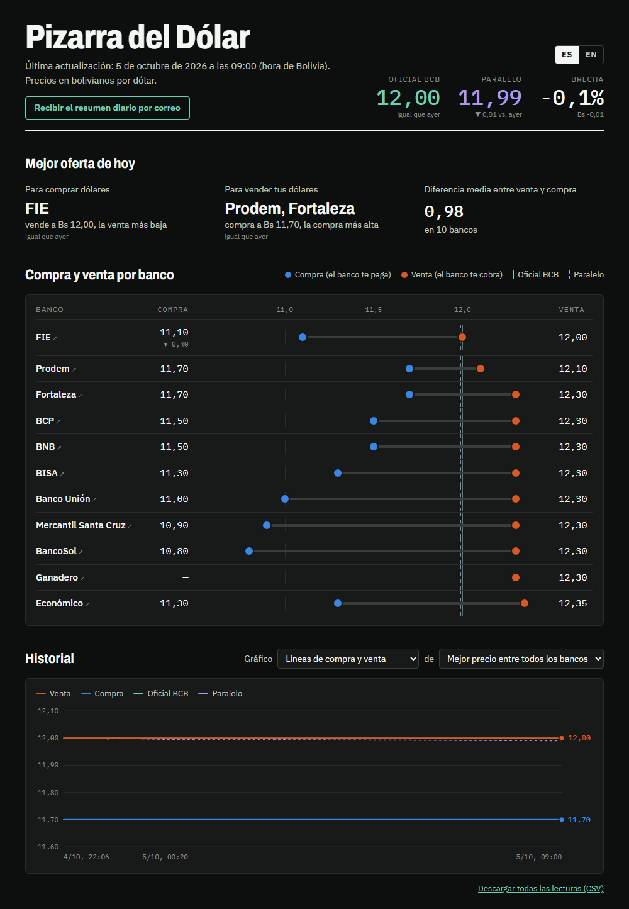

# Pizarra del Dólar

**Pizarra del Dólar** ("Dollar Board") shows, in one place, what the US dollar costs at
Bolivian banks today: what each bank pays for a dollar, what it charges for one, and how
those prices compare with the official rate of the Central Bank of Bolivia (BCB) and with
the parallel market.

- **See the board:** https://mrdavid656.github.io/dolar_tracking/
- **Get it by email every morning:** [subscribe or unsubscribe](https://docs.google.com/forms/d/e/1FAIpQLScOe99KN0www_aZeMoC_0ybw3MhPYlrhZhig9BZoGAecjbihg/viewform)

## What you will find

- **Best deal today:** the bank that sells the dollar cheapest and the bank that pays the
  most for it.
- **The gap:** how far the parallel rate sits above or below the official one, and what
  moved since yesterday.
- **Buy and sell by bank:** every bank on the same scale, next to the official and the
  parallel rate. Each name links to the bank's own site.
- **History:** how each bank's prices and the gap have moved, as lines or as daily and
  weekly candles.
- **Spanish and English**, with a switch at the top of the page.

Prices are read twice a day, at 07:00 and 19:00 (Bolivia time). The email
summary goes out at 08:00.

## Where the prices come from

Each bank's own public website: BNB, BCP, BISA, Mercantil Santa Cruz, Banco Unión,
Ganadero, Económico, FIE, BancoSol, Fortaleza and Prodem. The official rate comes from the
BCB. The parallel rate is the price of USDT in bolivianos on Binance P2P; the board shows
the midpoint between its buy and sell prices.

## The data

Every reading is kept in [`data/rates.csv`](data/rates.csv), one row per source, in
bolivianos per dollar. You are welcome to use it; the latest copy can be downloaded from
https://mrdavid656.github.io/dolar_tracking/rates.csv.

| column | meaning |
|---|---|
| `timestamp` | when the reading was taken (Bolivia time) |
| `bank` | the source; `BCB` is the official rate and `Parallel` the parallel market |
| `buy` | what the bank pays you for one dollar |
| `sell` | what the bank charges you for one dollar |
| `official` | the official rate shown on that bank's site |

An empty cell means the source does not publish that value.

## Please note

This is a personal project for informational purposes. It is not affiliated with any bank
or with the BCB. The figures are collected automatically from public websites and may
contain errors or arrive late; they are not financial advice. Always confirm a price with
the bank before acting on it.

Subscribers' email addresses are used only to send the daily summary. See the
[privacy policy](https://mrdavid656.github.io/dolar_tracking/privacy.html).

## Contact

Suggestions and error reports are welcome at davidgemio98@gmail.com.

Made by David Gemio. Released under the [MIT licence](LICENSE).
